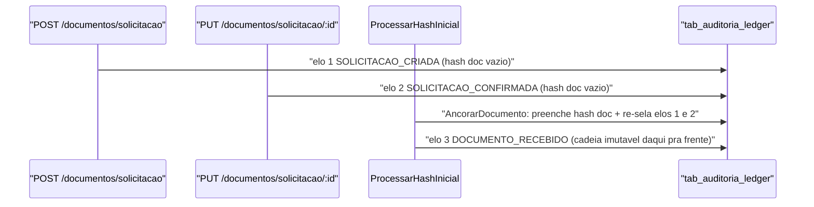

« # Cadeia mestre de auditoria da assinatura

## Decisões travadas (suas respostas)

- `tab_auditoria_ledger` deixa de ser só a trilha do PDF e passa a ser a **cadeia mestre**: rastreia o documento **e** cada objeto do fluxo.
- Colunas novas: `objeto_tipo`, `objeto_id`, `hash_objeto_inicial`, `hash_objeto_final`, `hash_documento_inicial`, `hash_documento_final`, `solicitacao_id`. `documento_id` e `hash_bytes_pdf` viram nullable.
- O elo (`hash_atual`) é calculado pelos **dois** lados: hashes do objeto **e** hashes do arquivo.
- Base de dados é descartável: sem coluna de versão de hash, sem compatibilidade com registros antigos.
- `codigo_verificacao` continua estável (não quebra a estampa já impressa). A validação do documento em si passa a ser por **upload do PDF**.
- Validações requisitadas ganham tabela própria `tab_documento_validacao` + ledger próprio.
- QR aponta para `${URL_FRONT}/verificar/{codigo_verificacao}`.
- `.gitignore` ajustado para não ignorar `api/public`; logo lida de `api/public/logo.jpeg`.
- `.cursorignore` linha 5: `certs/` vira `/certs/` (libera `api/certs/`, mantém os certificados TLS da raiz bloqueados).
- Relatório final em `docs/relatorios/sprint-cadeia-auditoria.md`.

## Como o "hash do arquivo chega depois" se resolve sem romper a cadeia

Você pediu que o elo use objeto **e** arquivo, mas o hash do arquivo só existe depois do upload. A conciliação é uma **ancoragem única, dentro da transação em que o documento nasce**:



- Elos gravados antes do documento existir entram com `hash_documento_inicial` / `hash_documento_final` nulos e `documento_id` nulo, amarrados por `solicitacao_id`.
- Em `ProcessarHashInicial`, **antes** de inserir `DOCUMENTO_RECEBIDO** e na mesma `trx`: preenche `documento_id`+ hashes do arquivo nos elos pendentes, recalcula`hash_atual`em ordem de`sequencia`, re-encadeia `hash_registro_anterior`, e regrava a prova no vault (novo ZIP + carimbo, o ZIP antigo não é apagado). `metadata_json`guarda`ancorado_em`e`hash_atual_pre_ancoragem`.
- Depois da ancoragem a cadeia nunca mais sofre UPDATE.
- `hash_documento_final` de cada elo posterior é o hash real do PDF após aquele evento (estampa, folha, selo).
- `sequencia` é global na cadeia (1..N) e sempre `ultimo.sequencia + 1` em runtime — a `unique (documento_id, sequencia)` continua válida depois da ancoragem, e ganha par `unique (solicitacao_id, sequencia)`.
- A consulta de validação pública **não** entra na cadeia mestre: você definiu `DOCUMENTO_SELADO` como o último elo, então a validação vai para a trilha própria referenciando o `hash_atual` do elo final.

---

## Onda 0 — Fundação (1 agente, bloqueia todo o resto)

Dono exclusivo destes arquivos. Nenhum outro agente os edita.

- `.cursorignore` (linha 5) e `.gitignore` (padrão `public*`).
- Migration `20260916000000_tab_auditoria_ledger_cadeia_mestre.js`: colunas novas, nullable em `documento_id`/`hash_bytes_pdf`, FK `solicitacao_id`, `unique (solicitacao_id, sequencia)`, índices por `objeto_tipo`/`objeto_id`.
- Migration `20260916000100_tab_documento_validacao.js`: `id`, `documento_id`, `codigo_consultado`, `hash_documento_enviado`, `veredito`, `hash_conferido_com` (original/final/elo), `auditoria_ledger_id`, `ip`, `porta_logica`, `user_agent`, `data_criacao`, `deletado`.
- Migration `20260916000200_tab_auditoria_ledger_documento_validacao.js`: padrão dos outros `tab_auditoria_ledger_*` (`payload_sha256`, `bucket_path`, `object_name`, `auditoria_ledger_origem`).
- `api/certs/index.js`: **todas** as keys novas de uma vez (nenhum outro agente toca aqui) — `eventoAuditoria` com `solicitacao_criada`, `solicitacao_confirmada`, `signatario_adicionado`, `demarcacao_definida`, `documento_pronto_assinatura`, `aceite_termo_registrado`, `sessao_assinatura_aberta`, `sessao_assinatura_confirmada`, `biometria_recebida`, `biometria_validada`, `biometria_negada`, `estampa_solicitada`, `assinatura_solicitada`, `folha_auditoria_gerada`, `documento_selado`, `documento_validacao_solicitada`; ajuste de `documento_recebido.sequencia`; novo bloco `objetoAuditoria` (solicitacao, documento, signatario, demarcacao, aceite_termo, desafio_autenticacao, identificacao_biometrica, evento, documento_validacao); `buckets.pastas.documento_validacao_ledger`; `statusValidacaoDocumento` (`integro`, `divergente`, `nao_encontrado`).
- `api/@core/domain/AuditoriaLedger.js`: campos novos, `getAuditoriaLedger` e `calcularHashAtual` incluindo objeto + arquivo, na ordem `id | solicitacao_id | documento_id | objeto_tipo | objeto_id | desafio_acesso_id | tipo_evento | sequencia | hash_objeto_inicial | hash_objeto_final | hash_documento_inicial | hash_documento_final | hash_registro_anterior | criado_em`.
- Novos domains `api/@core/domain/DocumentoValidacao.js` e `api/@core/domain/AuditoriaLedgerDocumentoValidacao.js` (forma copiada de `DocumentoVerificacao.js` e dos demais ledgers).
- `api/infrastructure/gateways/helpers/AuditoriaAlteracao/LadgerDocumentoPdf/index.js`: `GravarEvento` com os parâmetros novos + método `AncorarDocumento`.
- Novo helper `.../AuditoriaAlteracao/LadgerDocumentoValidacao/index.js` (grafia `Ladger` mantida).
- Novo `api/infrastructure/db/services/DocumentoValidacaoRepository.js`.

### Contratos congelados (todos os agentes consomem, ninguém altera)

```js
// api/infrastructure/gateways/helpers/AuditoriaAlteracao/LadgerDocumentoPdf/index.js
await new LedgerDocumentoPdf(trx).GravarEvento({
  solicitacao_id,
  documento_id, // um dos dois pode ser null
  objeto_tipo: objetoAuditoria.signatario, // certs
  objeto_id,
  objeto, // snapshot atual do agregado -> hash_objeto_final
  objeto_anterior, // snapshot antes da mutacao -> hash_objeto_inicial (null na criacao)
  desafio_acesso_id,
  tipo_evento: eventoAuditoria.signatario_adicionado.label,
  sequencia,
  meta_data,
  hash_documento_inicial,
  hash_documento_final, // null antes da ancoragem
  hash_registro_anterior,
  user_id,
});

await new LedgerDocumentoPdf(trx).AncorarDocumento({
  solicitacao_id,
  documento_id,
  hash_documento_inicial,
  hash_documento_final,
  user_id,
});
```

O helper calcula os hashes de objeto internamente (SHA-256 do JSON do snapshot), no mesmo espírito do `Initialize(old)` dos outros `Ladger*`.

Leitura do último elo, idêntica em todo chamador:

```js
const ultimoElo = await trx('tab_auditoria_ledger')
    .where(function () { this.where('documento_id', documento_id).orWhere('solicitacao_id', solicitacao_id) })
    .where('deletado', false)
    .orderBy('sequencia', 'desc')
    .first();
const sequencia = ultimoElo ? Number(ultimoElo.sequencia) + 1 : eventoAuditoria.<evt>.sequencia;
```

Folha de auditoria:

```js
adicionarFolhaAuditoria({
  pdfBytes,
  documento,
  codigoVerificacao,
  signatarios,
  urlVerificacao,
  trilha,
});
```

---

## Onda 1 — Implementação (8 agentes em paralelo, arquivos disjuntos)

- **A1 Solicitação e ancoragem** — [api/@core/usecase/Documentos/createDocumentosUseCase.js](api/@core/usecase/Documentos/createDocumentosUseCase.js) (elo `SOLICITACAO_CRIADA` em `indexDocumentos`, `SOLICITACAO_CONFIRMADA` em `validateDocument`) e [api/infrastructure/queue/handler/ProcessarHashInicial/index.js](api/infrastructure/queue/handler/ProcessarHashInicial/index.js) (`AncorarDocumento` + elo `DOCUMENTO_RECEBIDO` com os campos novos).
- **A2 Signatários** — [api/@core/usecase/Signatarios/createSignatariosUseCase.js](api/@core/usecase/Signatarios/createSignatariosUseCase.js): um elo por signatário, um por demarcação, um `DOCUMENTO_PRONTO_ASSINATURA`; remover o `ultimoLedger` morto das linhas 111–116.
- **A3 Cerimônia e biometria** — [api/@core/usecase/Assinatura/createAssinatura.js](api/@core/usecase/Assinatura/createAssinatura.js) (`SESSAO_ASSINATURA_ABERTA`, `SESSAO_ASSINATURA_CONFIRMADA`, `BIOMETRIA_RECEBIDA`), [api/@core/usecase/TermoResponsabilidade/createTermoResponsabilidadeUseCase.js](api/@core/usecase/TermoResponsabilidade/createTermoResponsabilidadeUseCase.js) (`ACEITE_TERMO_REGISTRADO`) e [api/infrastructure/queue/handler/ProcessarBiometria/index.js](api/infrastructure/queue/handler/ProcessarBiometria/index.js) (`BIOMETRIA_VALIDADA` / `BIOMETRIA_NEGADA`).
- **A4 Estampa, assinatura e selagem** — [api/@core/usecase/Assinatura/createAssinaturaUseCase.js](api/@core/usecase/Assinatura/createAssinaturaUseCase.js) (`ESTAMPA_SOLICITADA`, `ASSINATURA_SOLICITADA`) e [api/infrastructure/queue/handler/AplicarAssinatura/index.js](api/infrastructure/queue/handler/AplicarAssinatura/index.js) (`ASSINATURA_APLICADA` por signatário, `FOLHA_AUDITORIA_GERADA`, e `DOCUMENTO_SELADO` como elo final com `hash_documento_final`).
- **A5 Folha de auditoria** — [api/infrastructure/gateways/PdfSign/aplicarAssinaturaPdf.js](api/infrastructure/gateways/PdfSign/aplicarAssinaturaPdf.js): cabeçalho com a logo (`fs` + `embedJpg` de `api/public/logo.jpeg`) e rodapé com paginação em **todas** as páginas da folha, QR gerado com a lib `qrcode` (já em `api/package.json`, `^1.5.3`) apontando para `${URL_FRONT}/verificar/{codigo}`, e a trilha de assinatura impressa do início ao fim. Continua sendo chamada antes de `aplicarSeloPlataforma`.
- **A6 Análise profunda** — [api/@core/usecase/AuditoriaLedger/gerarCertificadoAuditoriaUseCase.js](api/@core/usecase/AuditoriaLedger/gerarCertificadoAuditoriaUseCase.js): manter a conferência objeto por objeto como está e acrescentar `trilha_assinatura` (a cadeia mestre do primeiro elo ao selo), conferindo objeto + arquivo em cada elo e marcando os elos ancorados.
- **A7 Validação do documento enviado** — novo `api/@core/usecase/AuditoriaLedger/validarDocumentoEnviadoUseCase.js`, [api/infrastructure/Controllers/AuditoriaCertificadoController.js](api/infrastructure/Controllers/AuditoriaCertificadoController.js) e [api/infrastructure/routes/index.js](api/infrastructure/routes/index.js): recebe o PDF, valida magic bytes, calcula SHA-256, compara com `hash_original`, `hash_final` e cada `hash_documento_final` da cadeia, grava `tab_documento_validacao` + ledger próprio, devolve o veredito e em qual elo o arquivo casou.
- **A8 Frontend `/verificar`** — [frontend/src/Views/Verificar/index.jsx](frontend/src/Views/Verificar/index.jsx): upload do PDF para a nova rota e exibição da trilha de assinatura.

## Onda 2 — Revisão (9 agentes em paralelo, somente diagnóstico)

Cada um devolve lista de furos com arquivo e linha; ninguém edita. Focos: integridade da cadeia e da ancoragem; transações e side-effects pós-commit; conferência redundante (`status` + `exit`, duas passagens com `forUpdate`, ids do payload contra o banco); corretude de ledger (`Initialize`, `meta_data` leve, `ErrorLedger*` tratado, nada de `cms_base64` no MySQL); schema contra código; folha de auditoria com leitura real do QR e selo PAdES intacto; segurança da validação pública (limite de tamanho, magic bytes, `timingSafeEqual`, abuso); estilo do repositório (CommonJS, early return, typos `trnasformcao` e `Ladger` preservados, nada inventado); e fumaça (`knex migrate:latest` + rollback, `node --check` nos arquivos tocados, boot da API).

## Onda 3 — Correção e relatório

- Os 8 agentes da onda 1 são retomados com os furos dos **seus** arquivos, mantendo a mesma divisão de propriedade — sem conflito de escrita.
- 1 agente escreve `docs/relatorios/sprint-cadeia-auditoria.md` com o que mudou, por quê, o desenho da cadeia, a decisão de ancoragem, os eventos novos de `certs` e os furos encontrados e corrigidos. »
