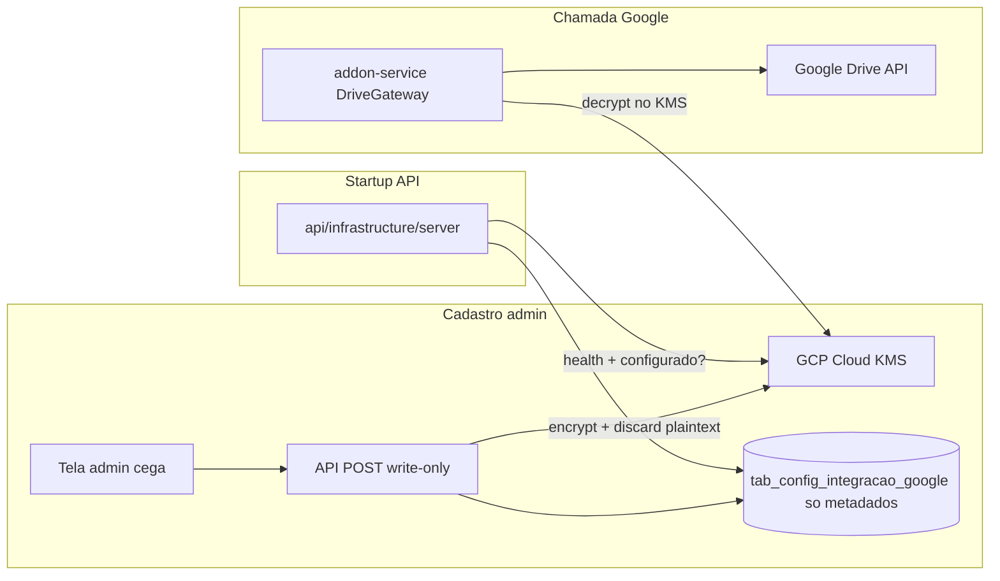
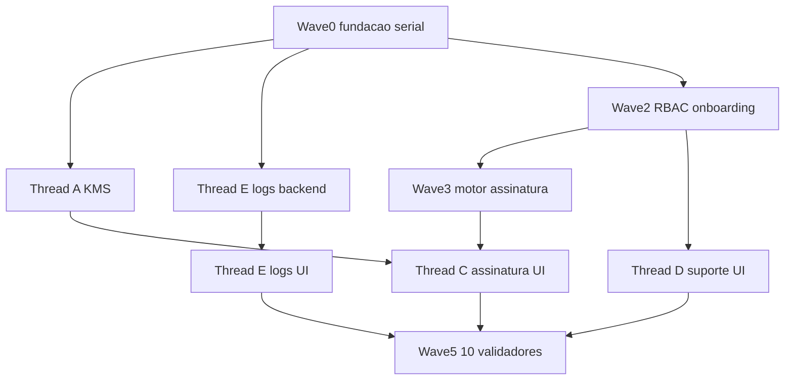

# Finalização do sistema (KMS, RBAC, assinatura, suporte, logs)

## Decisões travadas (aprovação = concordar com isto)

- **KMS write-once na API:** o admin POSTA as credenciais Google na API principal. O PEM/secret entra só na memória, é cifrado no Cloud KMS, o plaintext é descartado. `GET` devolve apenas `{ configurado, cadastrado_em }`. **Nunca** devolve a chave. Recadastro = overwrite cego. O **addon-service** descriptografa no KMS na hora do JWT Drive — a API **não** é proxy da chave.
- **Biometria habilitada = PDF bloqueado:** modos `AVANCADA` e `AMBAS` exigem perfil biométrico **aprovado** para `GET /assinatura/documentos/:id` (e progresso/download). OTP da cerimônia só entra **depois** dessa aprovação. Modo `SIMPLES` não exige biometria para ver o PDF; perfil + OTP continuam obrigatórios para qualquer ação.
- **Tenant = esta instância** (1 cliente = 1 fatia, como em [docs/planejamento/02-capacidade-fabricante-compartilhado.md](docs/planejamento/02-capacidade-fabricante-compartilhado.md)). O painel de suporte mostra peso/consumo **deste** deploy, sem `tenant_id` novo.
- **Primeiro gestor:** aprovação de biometria é exclusiva do papel `gestor`. Para não travar o bootstrap, o **primeiro** gestor nomeado pelo superadmin tem biometria auto-aprovada com `systemUser.id`. Os seguintes são aprovados por gestores já existentes.
- **Não entra neste plano** a sprint de ledger/HMAC/QR da folha de auditoria em [docs/Alteacoes/Ladger.txt](docs/Alteacoes/Ladger.txt) (já há trabalho paralelo nesse git status).

## Estado atual (gap)

- Google Workspace vive no **addon-service**: PEM/OAuth em `.env` + JSON no disco. API principal **não** fala com Google nem com GCP KMS.
- Roles reais: `system -1`, `admin 0`, `user/gerente 1`, `signer 2`. Aprovação biométrica só `authUser.admin`. Auto-aprovação hoje = único admin aprovando a si mesmo ([updatePerfilBiometriaUseCase.js](api/@core/usecase/PerfilBiometria/updatePerfilBiometriaUseCase.js) ~146–151), **não** usa `systemUser`.
- Seed cria `gabriel@` e `davi@` como **admin** ([api/knex/seeds/usuario.js](api/knex/seeds/usuario.js)).
- Cerimônia é **sempre** OTP → FaceMatch → PDF. Sem modo de sistema. `#gateOnboarding` em [createAssinatura.js](api/@core/usecase/Assinatura/createAssinatura.js) exige senha + 2FA + perfil; `#biometriaCadastrada` só na cerimônia, **não** no `getDocumentoAssinatura`.
- Logs de produto = exceções em `tab_logs_do_sistema`. Pino já redige campos, mas **não** há jornada por área.
- Sem papel suporte, sem painel sanitizado.

## Arquitetura alvo

ADC / Workload Identity (ou um SA **só** de infra, fora do repo) autentica o cliente KMS. Isso **não** é a chave do Workspace. Os JSON `addon-service/*.json` saem do caminho operacional.

## Papéis

Constantes em [api/certs/index.js](api/certs/index.js) (números novos, sem mover os atuais):

- `admin: 0` — superadmin é o **primeiro** admin humano (`userMasterEmail` / `davi@`), gravado em `tab_config_sistema.superadmin_id`. Configura modo de assinatura e credenciais Google.
- `user: 1` — painel (cria solicitações).
- `signer: 2` — signatário.
- `gestor: 3` — **só ele** aprova biometria de terceiros.
- `suporte: 4` — fabricante; só cria outros `suporte`; painel sanitizado.

`systemUser` (`2f09833b-001e-4eaf-9c75-ed8ceaf3d181`) permanece bloqueado; vira `aprovado_por` da biometria do superadmin (e do primeiro gestor).

Front: [frontend/src/Config/index.jsx](frontend/src/Config/index.jsx) + [frontend/src/utils/roles.js](frontend/src/utils/roles.js) ganham `GESTOR` / `SUPORTE` e capabilities (`approveBiometria` sai do admin).

## Tabelas novas (migrations pedidas nesta sprint)

- `tab_config_sistema`: `id`, `superadmin_id`, `modo_assinatura` (`SIMPLES|AVANCADA|AMBAS` nullable até o setup), `inicializado`, datas.
- `tab_config_integracao_google`: `kms_resource`, `kms_key_version`, `configurado`, `cadastrado_em`, `cadastrado_por` — **zero** PEM/secret.
- `tab_jornada_log`: `area`, `jornada` (ex. `LOGIN`, `CADASTRAR_DOCUMENTO`, `ASSINAR`), `evento`, `resultado`, `mensagem` sanitizada, `correlacao_opaca` (hash de ids, nunca id cru se for PII), `user_role`. Sem body, CPF, e-mail, hash de PDF, token, embedding.

Constantes de modo/área/jornada entram em `certs` (key sem `.versions`).

## Ondas e donos de arquivo (paralelismo)

Arquivo de estado (orquestrador, uma vez na Wave 0): [.cursor/plans/estado-finalizacao-sistema.md](.cursor/plans/estado-finalizacao-sistema.md) — quem está em qual onda, arquivos locked.

**Regra:** um agente **não** edita arquivo de outro. Conflitos conhecidos (`certs`, rotas, `roles.js`, Router, seed) só o orquestrador / Wave 0.

### Wave 0 — serial (orquestrador)

Único dono: `api/certs/index.js`, `api/knex/seeds/usuario.js`, três migrations, stubs de rotas em [api/infrastructure/routes/admin/index.js](api/infrastructure/routes/admin/index.js), middleware `authUser.gestor` / `authUser.suporte` em [authUser.js](api/infrastructure/gateways/middleware/authUser.js) + [checkUser.js](api/@core/usecase/Usuario/checkUser.js), roles no front (`Config` + `roles.js`).

Seed: `systemUser` inalterado; `davi@netexperts.com.br` admin; `gabriel@netexperts.com.br` **suporte** (deixa de ser admin). Startup/seed garante o suporte se a linha não existir.

### Wave 1 — paralelo

**Thread A — KMS** (não toca RBAC nem Assinar)

- Lib `@google-cloud/kms` na API e no addon-service.
- Gateway inline no estilo do repo (classe no path de gateways existente, sem pasta “service” nova): encrypt/decrypt/health.
- Use case admin write-only + GET metadados; controller fino; só `authUser.admin`.
- Startup em [api/infrastructure/server/index.js](api/infrastructure/server/index.js): ping KMS + flag `configurado`; **não** carrega PEM na memória da API.
- [addon-service/infrastructure/gateways/Drive/index.js](addon-service/infrastructure/gateways/Drive/index.js) e [GoogleOAuth](addon-service/infrastructure/gateways/GoogleOAuth/index.js): deixar de ler `GOOGLE_SA_PRIVATE_KEY` / `GOOGLE_OAUTH_CLIENT_SECRET` do env; decrypt no KMS. Fallback de env só se KMS não configurado (dev), logar que é legado.
- UI admin: formulário cego (campos SA e-mail, PEM, OAuth id/secret/redirect). Sem “mostrar chave”. Se já configurado, só botão “Cadastrar novamente”.
- Env novo: `GCP_PROJECT_ID`, `GCP_KMS_LOCATION`, `GCP_KMS_KEY_RING`, `GCP_KMS_CRYPTO_KEY` — **não** commit de JSON.

**Thread E (backend logs)** — paralelo à A

- Domain + repo + insert de jornada nos pontos: login, create documento, signatários, sessão assinatura, cadastro perfil/biometria, create user. Mensagem só rótulo (`LOGIN_OK`, `DOCUMENTO_CRIADO`) — sem payload.
- Endurecer `_redactSensitive` em [api/Logs/index.js](api/Logs/index.js) (private_key, embedding, cms, hash de arquivo).
- Endpoint suporte `GET /suporte/logs` com filtro `area` + `jornada`; DTO sem PII. Admin técnico continua em `/logs` mas a listagem nova é por área.

### Wave 2 — RBAC + onboarding (depois da Wave 0)

- `criarUsuario`: admin cria admin/user/gestor/signer; **suporte só cria suporte**.
- Trocar rotas de aprovação biométrica de `authUser.admin` para `authUser.gestor` ([admin/index.js](api/infrastructure/routes/admin/index.js) L64–67).
- Remover auto-aprovação “único admin”.
- [createPerfilBiometriaUseCase.js](api/@core/usecase/PerfilBiometria/createPerfilBiometriaUseCase.js): se o usuário é o superadmin e `tab_config_sistema` ainda não inicializou, na **mesma trx** vetoriza FaceMatch, grava embedding, `aprovado_por = systemUser.id`, `aprovado_em = dateNow()`, sem alerta a admins.
- Login `next_step` ([login.js](api/@core/usecase/Login/login.js) + 2FA): após perfil, forçar `CADASTRAR_BIOMETRIA` para o superadmin mesmo que o modo venha a ser `SIMPLES`; depois `CONFIGURAR_SISTEMA` até `modo_assinatura` preenchido; então o sistema abre.
- Tela de configuração inicial (admin): três opções — avançada / simples / ambas. Depois só admin altera.
- Front: `/aprovacao-biometria` só `GESTOR`; `/configuracao-sistema` só admin; onboarding biometria no fluxo do primeiro admin.

### Wave 3 — motor de assinatura (depois da Wave 2)

Arquivos: [createAssinatura.js](api/@core/usecase/Assinatura/createAssinatura.js), espelho [createAssinaturaUseCase.js](api/@core/usecase/Assinatura/createAssinaturaUseCase.js), [AssinaturaController.js](api/infrastructure/Controllers/AssinaturaController.js). Addon [Assinarweb.html](Addon/Assinarweb.html) / cerimônia do addon-service só lê o modo via API (não duplicar regra).

Herdar `modo_assinatura` em **todo** início de sessão/progresso/GET documento:

- Sem modo configurado → recusar cerimônia (“sistema em configuração”).
- `SIMPLES`: pular FaceMatch; não devolver etapa câmera; `#gateOnboarding` (perfil+OTP) permanece; **não** chamar `#biometriaCadastrada`.
- `AVANCADA` e `AMBAS`: antes de URL do PDF, exigir `#biometriaCadastrada`. Sem cadastro aprovado → 403 de negócio, **sem** `pdf_url`.
- `AMBAS`: depois da biometria aprovada, UI pode escolher OTP vs câmera. `AVANCADA`/`SIMPLES`: **não** enviar flag de toggle.
- Endpoint `GET /config/modo-assinatura` (autenticado) devolve só `{ modo }` para o front/addon esconder botões. Backend **revalida**; o front não é fonte da verdade.

### Wave 4 — UIs em paralelo (donos disjuntos)

- **C:** [frontend/src/Views/Assinar/](frontend/src/Views/Assinar/) — herdar modo, ocultar toggle, redirecionar se 403 biométrico.
- **D:** painel `/suporte` — docs assinados (contagem/status, sem nome/CPF/e-mail), peso (bytes aproximados do bucket/WIP+vault **agregado**, sem object key), processos ativos (filas Rabbit + solicitações em status não terminal, ids opacos), texto do perfil suporte. Endpoints `GET /suporte/dashboard` montam DTO **no use case** (whitelist de campos). `authUser.suporte`. Não reusar `getSolicitacoes` / `getDocumentoDownload`.
- **E:** remodelar [frontend/src/Views/Tecnico/Logs](frontend/src/Views/Tecnico/Logs/index.jsx) e uma view suporte de logs: abas por `area` (auth, documento, assinatura, biometria, usuario, integracao, sistema) + filtro de jornada.

### Wave 5 — 10 agentes de validação em paralelo

Só leitura / grep / testes pontuais; relatório único. Checklist:

1. **KMS:** API não persiste/devolve PEM; addon decrypta; GET cego; recadastro overwrite.
2. **RBAC:** gestor aprova; admin não acessa rotas de aprovação; suporte só cria suporte; seed do gabriel.
3. **Onboarding:** superadmin perfil+OTP+biometria; `aprovado_por === systemUser.id`; `CONFIGURAR_SISTEMA` depois.
4. **Assinatura:** herança do modo; toggle só em `AMBAS`; SIMPLES sem câmera.
5. **Proteção de documento:** `getDocumentoAssinatura` sem `pdf_url` se modo tem biometria e cadastro falta.
6. **PII suporte:** payloads `/suporte/*` sem e-mail, CPF, nome de documento, URL de PDF, hash, embedding.
7. **Dashboard suporte:** contagens, peso agregado, processos ativos.
8. **Sanitização de logs:** jornada e Pino sem payload transacional (varrer `Logger.` / `console.log` novos).
9. **Logs por área/jornada:** UI filtrável; correlacao opaca.
10. **Conflito de merge:** `certs`, rotas, `roles.js`, Router, seed sem regressão cruzada.

Relatório em `docs/relatorios/sprint-finalizacao-sistema.md`.

## Estilo (obrigatório)

Copiar forma de [createDocumentosUseCase.js](api/@core/usecase/Documentos/createDocumentosUseCase.js) / [createPerfilUsuarioUseCase.js](api/@core/usecase/PerfilUsuario/createPerfilUsuarioUseCase.js): CommonJS, `status`+`exit` separados, `old*` antes de mutar, trx → persist → ledger se o agregado já tiver helper → histórico → commit → side-effect. Sem service/policy/mapper. Mensagens genéricas no inesperado. Catch `ErrorLedger*` se tocar entidade auditada.

## Fora de escopo desta execução

- Ledger/HMAC/QR da sprint Ladger (já em andamento).
- Console fabricante multi-instância (agregar vários clientes).
- Mover o Drive para dentro da API principal.
