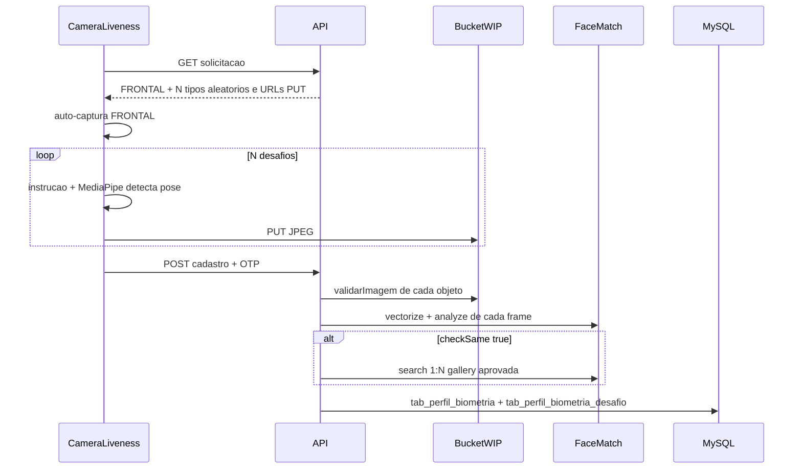
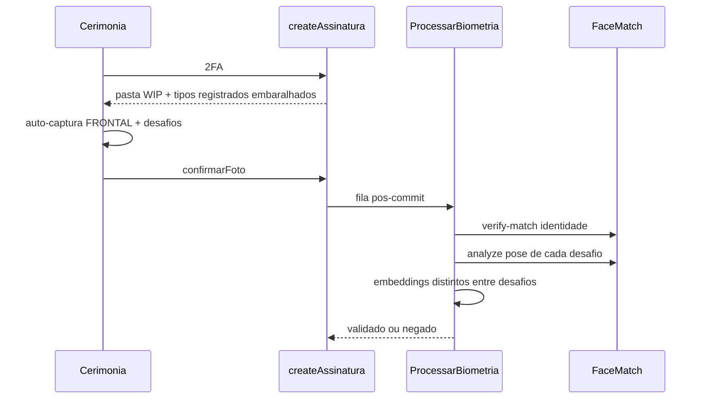
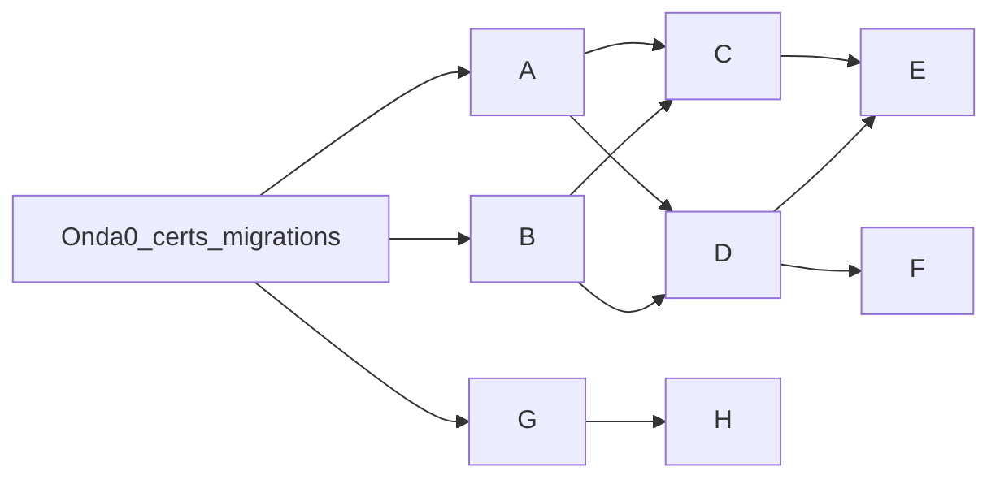

# Plano: Liveness biométrico + reuso de signatários

## Estado atual (o que muda)

Hoje o cadastro e a cerimônia usam **1 JPEG estático** com countdown de 3s e clique em Capturar ([`frontend/src/Components/CameraLiveness/index.jsx`](frontend/src/Components/CameraLiveness/index.jsx)). O FaceMatch só faz 1:1 (`vectorize` / `verify-match`). A flag [`checkBiometri.checkSame`](api/certs/index.js) **existe e não é lida**. Não há tabela de config, nem busca de signatários.

Fora deste plano (já documentado em [`docs/Alteacoes/ConfigSistema.txt`](docs/Alteacoes/ConfigSistema.txt)): KMS GCP, papel gestor/suporte, onboarding do superadmin, herança modo assinatura, painel de suporte e logs. Aqui o ConfigSistema entra **só** como persistência da quantidade de desafios.

## Decisões travadas

- Quantidade de desafios: fatia mínima de **ConfigSistema** (tabela singleton + GET autenticado + PUT admin). Padrão **5**, piso **3**. Hoje o papel equivalente a superadmin é `roles.admin`.
- Foto **FRONTAL** (rosto parado) é a única imagem do painel de aprovação. Os N desafios **não** aparecem na fila; servem de padrão para a cerimônia.
- Captura **automática** no client (sem clique): MediaPipe Face Landmarker via **CDN** (frontend e add-on), para não brigar com o CRA. O servidor **não confia** no client: FaceMatch `/analyze` revalida pose com os 5 keypoints que o YuNet/SCRFD **já devolve**.
- Anti-spoof na cerimônia: identidade 1:1 contra `rosto_embeddign` + pose de cada desafio igual ao tipo pedido + embeddings dos desafios **distintos entre si** (foto parada não passa).
- `checkSame === true`: 1:N **antes do insert** do cadastro, contra embeddings aprovados de **outros** usuários. Recusa com mensagem de regra, sem gravar perfil.
- Sem helper de ledger novo. Desafios entram na mesma trx do agregado, `meta_data` leve. Sem `cms_base64`. Fila só depois do commit.

## Fluxos alvo





## Contrato compartilhado (Onda 0 — 1 agente, bloqueia o resto)

Único dono de [`api/certs/index.js`](api/certs/index.js) e das migrations novas. Ninguém mais mexe em certs.

**Keys novas (sem `.versions`):**

```js
livenessDesafio: {
  tipos: {
    frontal: 'FRONTAL',
    virar_esquerda: 'VIRAR_ESQUERDA',
    virar_direita: 'VIRAR_DIREITA',
    olhar_cima: 'OLHAR_CIMA',
    olhar_baixo: 'OLHAR_BAIXO',
    sorrir: 'SORRIR',
  },
  minimo: 3,
  padrao: 5,
}
```

`checkBiometri.checkSame` permanece onde está. Instruções de UI (texto curto PT) podem viver no frontend/add-on, não no certs.

**Migrations (timestamps novos, um arquivo cada):**

1. `tab_config_sistema` — linha única: `id`, `quantidade_desafios_liveness` (int, default 5), datas, `deletado`. Seed com 5. Comentário no arquivo: próximas colunas do ConfigSistema entram por `alter`, não recriar a tabela.
2. `tab_perfil_biometria_desafio` — `id`, `perfil_biometria_id`, `tipo` (string do catálogo), `ordem`, `rosto_embeddign` (JSON string, mesmo typo do repo), `bucket_wip_path`, datas, `deletado`. Unique `(perfil_biometria_id, tipo)` onde `deletado = false`.

Cerimônia: **sem tabela filha**. `tab_identificacao_biometrica.bucket_wip_path` vira prefixo de pasta (`.../{identificacao_id}/`); objetos `FRONTAL`, `VIRAR_ESQUERDA`, etc. O worker monta os nomes a partir dos tipos persistidos no perfil.

## Dono de arquivo por agente (não sobrepor)

| Agente                 | Pode editar                                                                                                                                                                                                                                                                                                                                                                                                                                      | Proibido                                                  |
| ---------------------- | ------------------------------------------------------------------------------------------------------------------------------------------------------------------------------------------------------------------------------------------------------------------------------------------------------------------------------------------------------------------------------------------------------------------------------------------------ | --------------------------------------------------------- |
| **O0 Contrato**        | `api/certs/index.js`, 2 migrations novas                                                                                                                                                                                                                                                                                                                                                                                                         | qualquer use case / UI                                    |
| **A FaceMatch**        | `face-match/app/**`, testes Python, `api/infrastructure/gateways/FaceMatch/**`                                                                                                                                                                                                                                                                                                                                                                   | certs, use cases                                          |
| **B ConfigSistema**    | domain/repo/use case/controller ConfigSistema (pastas novas), `frontend` tela admin de quantidade, **só append** de 2 rotas no fim de [`api/infrastructure/routes/admin/index.js`](api/infrastructure/routes/admin/index.js)                                                                                                                                                                                                                     | certs, PerfilBiometria, CameraLiveness                    |
| **C Cadastro**         | [`createPerfilBiometriaUseCase.js`](api/@core/usecase/PerfilBiometria/createPerfilBiometriaUseCase.js), [`updatePerfilBiometriaUseCase.js`](api/@core/usecase/PerfilBiometria/updatePerfilBiometriaUseCase.js), get, domain, repo, [`PerfilBiometriaController.js`](api/infrastructure/Controllers/PerfilBiometriaController.js), **só o bloco** `/perfil-biometria/*` nas rotas                                                                 | FaceMatch folder, CameraLiveness, createAssinatura, Addon |
| **D Cerimonia**        | [`createAssinatura.js`](api/@core/usecase/Assinatura/createAssinatura.js), [`ProcessarBiometria/index.js`](api/infrastructure/queue/handler/ProcessarBiometria/index.js), domain/repo Identificacao, **só o bloco** `/assinatura/sessao*`                                                                                                                                                                                                        | PerfilBiometria use cases, frontend, Addon                |
| **E FrontCaptura**     | [`CameraLiveness`](frontend/src/Components/CameraLiveness/index.jsx), OnboardingBiometria, Biometria, Assinar/Auth, `frontend/src/services/biometria`, `frontend/src/services/assinatura`                                                                                                                                                                                                                                                        | Addon, API, wizard Nova                                   |
| **F AddonCaptura**     | [`addon-service/public/captura/index.html`](addon-service/public/captura/index.html), trechos de câmera em [`Addon/Assinarweb.html`](Addon/Assinarweb.html) se ainda duplicarem fluxo, BFF cerimônia **só se** o PUT único quebrar                                                                                                                                                                                                               | Cards.gs, Draft.gs, pedidos                               |
| **G SignatariosAPI**   | use case novo `getSignatariosHistorico` em pasta já existente [`api/@core/usecase/Signatarios/`](api/@core/usecase/Signatarios/), método no [`SignatariosController.js`](api/infrastructure/Controllers/SignatariosController.js), repo método novo, **append** `GET /signatarios/historico` após a rota POST de signatários, [`frontend/src/Views/Solicitacoes/Nova/index.jsx`](frontend/src/Views/Solicitacoes/Nova/index.jsx) + service panel | Addon, biometria                                          |
| **H AddonSignatarios** | [`Addon/Cards.gs`](Addon/Cards.gs), [`Addon/Actions.gs`](Addon/Actions.gs), [`Addon/Draft.gs`](Addon/Draft.gs), [`Addon/ApiClient.gs`](Addon/ApiClient.gs), proxy BFF `GET /signatarios/historico`                                                                                                                                                                                                                                               | captura HTML, API principal                               |

Regra das rotas: **não reordenar** blocos existentes; inserir imediatamente após o comentário do bloco dono.

---

## Onda 1 (paralelo após O0)

### A — FaceMatch: pose + 1:N

Estender [`face-match/app/main.py`](face-match/app/main.py) e [`schemas.py`](face-match/app/schemas.py):

- `POST /analyze` — 1 rosto; yaw/pitch a partir dos 5 kps já existentes; boca (distância cantos vs nariz) para `sorrir`. Resposta: `{ tipo_detectado, yaw, pitch, smile, embedding }`. Mapear para os labels do certs. Sem modelo novo.
- `POST /search` — `{ embedding, gallery: [{ id, embedding }] }` → `{ match, id, distance }` usando o `compare` atual e a mesma `tolerance`.

Gateway Node: métodos `analyze` e `search` no mesmo envelope `{ status, data, msg }`. Rotas em [`FaceMatch/config/index.js`](api/infrastructure/gateways/FaceMatch/config/index.js).

### B — ConfigSistema (fatia quantidade)

- Domain + repo + use case no estilo canônico (status/exit separados, admin no PUT).
- GET `All2FA`: devolve `{ quantidade_desafios_liveness }` (lido por cadastro e cerimônia).
- PUT `admin`: rejeita `< 3`; mensagem `"A quantidade de desafios não pode ser menor que 3."`.
- Tela admin mínima: um número + salvar. Sem o restante do ConfigSistema.txt.

Cadastro/cerimônia **não** leem o número só do certs: leem a tabela (certs só tem piso/padrão/catálogo).

---

## Onda 2 (paralelo após O0+A; B pode terminar em paralelo se C/D lerem config via repo)

### C — Cadastro e aprovação

[`solicitacaoPerfilBiometria`](api/@core/usecase/PerfilBiometria/createPerfilBiometriaUseCase.js): lê quantidade na config; sorteia N tipos **sem** FRONTAL; gera PUT WIP para `.../{perfil_id}/{desafio_id}/FRONTAL` e `.../{tipo}`; grava `session.biometria = { desafio_id, capturas: [{ tipo, object_name }] }`.

[`indexPerfilBiometria`](api/@core/usecase/PerfilBiometria/createPerfilBiometriaUseCase.js): para cada captura — `validarImagem` → `obterArquivoBase64` → `analyze` (tipo tem que bater) → embeddings dos desafios têm que dar match com o FRONTAL (mesma pessoa) e **não** ser iguais entre si. Se `checkBiometri.checkSame`: `search` na gallery `getEmbeddingsAprovados` excluindo o próprio `perfil_id`; se hit, apaga WIP e `return { status: false, msg: "Rosto já cadastrado para outro usuário." }`. Só então trx: insert pai + filhos + ledgers existentes + histórico + alerta. `rosto_embeddign` do pai continua sendo o embedding do FRONTAL.

Aprovação: painel continua servindo **só** o JPEG FRONTAL. Ao aprovar, re-vectoriza FRONTAL (como hoje), zera `bucket_wip_path` do pai **e** dos filhos, apaga WIP. Ao negar, soft-delete pai+filhos e remove WIP.

### D — Cerimônia e worker

2FA: pasta WIP da identificação; devolve lista `{ tipo, url, instrucao }` = FRONTAL + tipos **já gravados** em `tab_perfil_biometria_desafio` (embaralhados). Quantidade de desafios da cerimônia = os registrados (já limitados pela config no cadastro).

`confirmarRecebimento`: valida **todos** os objetos da pasta; status 1; payload da fila ganha `tipos: [...]`. Worker (modelo ProcessarBiometria, duas passagens):

1. Sem lock: FKs do payload = linha; cada arquivo existe; `analyze` de cada tipo; `verifyMatch` live FRONTAL vs embedding do perfil; cada desafio live vs embedding daquele tipo **e** vs base.
2. `forUpdate`: status ainda 1; mutar 2 ou 3; ledger + histórico; commit; apagar WIP da pasta. Falha de pose/identidade = negado sem retry. Falha de FaceMatch/bucket = retry.

---

## Onda 3 (UI — paralelo entre si após contrato da Onda 2 conhecido)

### E — Frontend captura

Reescrever `CameraLiveness`:

- Props: `etapas: [{ tipo, instrucao }]`, `onComplete(capturas)`.
- Overlay oval + texto do desafio atual + feedback (“Vire à esquerda…” / “Mantenha…”).
- MediaPipe CDN: yaw/pitch/smile; ao cruzar limiar por ~600ms, captura JPEG (mesmos limites 640px / 4MB) e avança. Sem botão Capturar.
- FRONTAL: rosto centralizado, yaw/pitch ~0.

Onboarding `/biometria` e `/assinar/:id/auth` só orquestram PUT + POST já existentes, agora em loop pelas etapas. GET config (ou a própria solicitação) traz N e instruções.

### F — Add-on captura

A cerimônia do add-on **não** cadastra perfil (continua no site). [`addon-service/public/captura/index.html`](addon-service/public/captura/index.html) replica a máquina de estados do CameraLiveness (CDN MediaPipe + auto-captura + PUTs). Hoje o iframe bloqueia câmera e abre esta aba — manter esse recorte.

---

## Onda 4 (signatários — pode começar na Onda 1 se G não tocar biometria)

### G — API + wizard do site

`GET /signatarios/historico?q=` (`authIntegracao.gerente`):

- Quem já teve `tab_signatarios.status = SIGNED` (distinct por `user_id`).
- `q` vazio: últimos N (limite).
- `q` e-mail/nome: LIKE no usuário/perfil.
- `q` com 11 dígitos: blind-index de CPF (não LIKE em ciphertext).
- Resposta para preencher o form: `nome`, `email`, `cpf` (decrypt no use case, mesmo padrão de [`createChaveIntegracaoUseCase`](api/@core/usecase/ChaveIntegracao/createChaveIntegracaoUseCase.js)), `telefone`. Sem embedding, sem documento.

Wizard [`Nova/index.jsx`](frontend/src/Views/Solicitacoes/Nova/index.jsx): busca no passo Signatários; ao escolher, preenche o card (nome/email/cpf/telefone) sem alterar `montarPayloadSignatarios`.

### H — Add-on busca

Proxy BFF na API Legacy (mesma chave de pedido). Card de destinatários: campo buscar + lista; `Draft.gs` recebe o mesmo shape `{ name, email, cpf, phone }` de hoje. Sem mudar `createPedidoUseCase` / payload de envio.

---

## Ordem de disparo



- **Onda 0:** 1 agente.
- **Onda 1:** A + B + G em paralelo.
- **Onda 2:** C + D em paralelo (C dono perfil, D dono assinatura/worker).
- **Onda 3:** E + F em paralelo.
- **Onda 4:** H depois de G.
- **Onda 5 (checagem):** 6 agentes só-leitura em paralelo — (1) cadastro+checkSame, (2) worker duas passagens, (3) Config minimo 3, (4) CameraLiveness sem clique, (5) captura add-on, (6) busca signatários site+addon — cada um devolve furos com arquivo:linha.

## Fora de escopo (não misturar)

KMS, gestor, suporte, auto-aprovação superadmin, herança simples/avançada, painel de tenant, remodelagem de logs. A tabela `tab_config_sistema` nasce magra de propósito para a leva do ConfigSistema **alterar**, não recriar.
