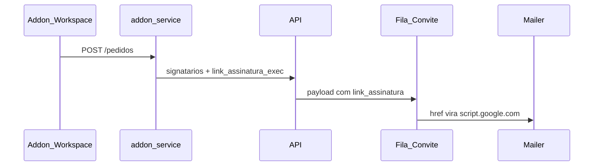

# Mapeamento: e-mails, links Workspace e furos

## Diagnóstico do relato

Quando o pedido nasce no Google Workspace, o **addon-service monta `link_assinatura` com `WEBAPP_URL`** (`https://script.google.com/macros/s/.../exec?modo=assinar&...&convite=HMAC`). A API **substitui** o link da plataforma por esse valor no SMTP.

```198:202:api/@core/usecase/Mail/enviarEmail.js
            let link = isCriarConta ? URLSITE : `${URLSITE}/assinar/${data.documento_id}`;
            if (data.link_assinatura && /^https?:\/\//.test(data.link_assinatura)) link = data.link_assinatura;
```

```269:270:addon-service/@core/usecase/Pedido/createPedidoUseCase.js
                    link_assinatura: webappUrl ? montarLinkAssinatura(webappUrl, documentoId, pedidoId, email) : null,
```

O copy do e-mail diz “acessar a plataforma”; o botão abre o **Apps Script**. Pedido pelo painel (sem `link_assinatura`) já vai para `${URL_FRONT}/assinar/:id`.

O HMAC do `/exec` é da **cerimônia no Workspace** (`addon-service` `/assinatura/convite`). O front `/assinar/:id` **não** consome esse HMAC. Por isso o e-mail deve apontar à plataforma; o `/exec` fica no card do Addon e no Web App.



---

## Inventário de e-mails (tudo passa pelo SMTP da API)

Gateway único: [api/infrastructure/gateways/Mail/Mailer.js](api/infrastructure/gateways/Mail/Mailer.js) (Mailpit em dev, Gmail em prod). From: `"NETEXPERTS" <MAIL>`. Sem `replyTo`. Base dos links da API: `URLSITE` = `process.env.URL_FRONT` em [api/certs/index.js](api/certs/index.js).

O Apps Script **não** envia e-mail (`MailApp` / `GmailApp` ausentes).

| #   | Tipo                                       | Gatilho                                                                                                                                                           | Template        | Link hoje                                                                 | Furo                                                                                                                                                                            |
| --- | ------------------------------------------ | ----------------------------------------------------------------------------------------------------------------------------------------------------------------- | --------------- | ------------------------------------------------------------------------- | ------------------------------------------------------------------------------------------------------------------------------------------------------------------------------- |
| 1   | Convite assinar                            | Fila `DistribuirConviteSignatario` após [createSignatariosUseCase.js](api/@core/usecase/Signatarios/createSignatariosUseCase.js) (painel **ou** pedido Workspace) | `mensagemLink`  | Painel: `URLSITE/assinar/:id`. Workspace: **`WEBAPP_URL` /exec**          | Relato do usuário                                                                                                                                                               |
| 2   | Convite + criar conta                      | Mesmo worker, `tipo=criar_conta`                                                                                                                                  | `mensagemLink`  | Sem payload: `URLSITE`. Com `link_assinatura`: **/exec** + senha em claro | Mesmo furo + senha no HTML                                                                                                                                                      |
| 3   | Documento cancelado                        | Fila `NotificarCancelamentoDocumento`                                                                                                                             | `mensagemLink`  | `URLSITE`                                                                 | OK de destino                                                                                                                                                                   |
| 4   | PDF assinado (anexo)                       | Fila `EnviarDocumentoAssinadoSignatarios`                                                                                                                         | `mensagemLink`  | `URLSITE`                                                                 | OK de destino                                                                                                                                                                   |
| 5   | Credenciais (admin cria user / card Addon) | [criarUsuario.js](api/@core/usecase/Usuario/criarUsuario.js)                                                                                                      | `base` (legado) | `URLSITE`                                                                 | Template/marca diferentes; senha em claro; `sendEmail` sem await no create                                                                                                      |
| 6   | Recuperar senha                            | [forgotPassword.js](api/@core/usecase/Forgot/forgotPassword.js)                                                                                                   | `base`          | `URLSITE/recuperarSenha/:token`                                           | Sem await; `URL_FRONT` vazio → `undefined/...`                                                                                                                                  |
| 7   | Troca de e-mail                            | [mudarEmail.js](api/@core/usecase/Usuario/mudarEmail.js)                                                                                                          | `base`          | `URLSITE/trocarEmail/:token`                                              | Sem await                                                                                                                                                                       |
| 8   | Alerta biometria / chave integração        | [Alerta/index.js](api/infrastructure/gateways/helpers/Alerta/index.js)                                                                                            | `baseOutButton` | Nenhum (texto “acesse o painel”)                                          | Sem URL; assunto com typo (`Soolicitaação`); e-mail **antes** do commit em [createPerfilBiometriaUseCase.js](api/@core/usecase/PerfilBiometria/createPerfilBiometriaUseCase.js) |

Morto (sem caller): `sendEmailCreate`, `sendEmailSecrete` (rodapé Matriz), investidor, `usuarioCliente.js` (método inexistente), [templates/index.html](api/infrastructure/gateways/Mail/templates/index.html) (netexperts.com.br).

---

## Onde o `/exec` deve continuar (fora do e-mail)

- [Addon/Config.gs](Addon/Config.gs) `getWebAppUrl()` — Script Properties / `ScriptApp.getService().getUrl()`
- [Addon/ApiClient.gs](Addon/ApiClient.gs) `montarLinkAssinaturaPendencia` — card “Documentos para assinar”
- [Addon/PlacementSession.gs](Addon/PlacementSession.gs) — `modo=placement`
- [addon-service/.../convite/index.js](addon-service/infrastructure/gateways/functions/convite/index.js) — HMAC para o Web App
- Fallback no iframe: [Addon/Assinarweb.html](Addon/Assinarweb.html) `abrirSite()` → `SITE_URL/assinar/:id`

Docs atuais ([addon-service/COMO-USAR.md](addon-service/COMO-USAR.md) L40, [Addon/README.md](Addon/README.md) L61) **documentam o bug como feature**: “WEBAPP_URL entra no link do convite por e-mail”.

---

## Outros furos que quebram envio / link

**URL e ambiente**

- `URL_FRONT` vazio na API → `undefined/assinar/...`, logo `` no template `base`
- Duas bases de site: API `URL_FRONT` vs addon `URLSITE`/`ADDON_URLSITE` (default compose `http://localhost:3395`)
- `URLSITECLIENTE = http://localhost:3000` em certs (legado; não entra no SMTP, mas confunde porta)
- Card e e-mail podem divergir se Script Properties `WEBAPP_URL` ≠ `addon-service/.env`
- Mailpit desta stack não publica `8025`/`1025` no Mac se o Mailpit da votação já tomou as portas (visto na subida local)

**Padronização visual / remetente**

- Três famílias de HTML: `mensagemLink` (LegacySignature), `base` / `baseOutButton` (NETEXPERTS / NetEventos / Matriz)
- `applicationName` = `Assinatura_Experts`; `bussines.nameCompany` = `NETEXPERTS`
- Sem `replyTo`; “não responda” no rodapé
- Alertas sem botão para o painel

**Confiabilidade**

- Recovery / troca de e-mail / create user: SMTP fire-and-forget
- Alerta de biometria no create: `enviarEmails()` **dentro da trx**, antes do commit (e-mail pode sair e a trx falhar)
- Senha temporária em HTML (credenciais + convite `criar_conta`)

---

## Correção proposta (quando for implementar)

Escopo mínimo, estilo do repo (inline, sem helper novo, sem migration):

1. **SMTP sempre plataforma** em `sendEmailConviteSignatario`: ignorar `link_assinatura` no href. Manter `URLSITE` / `URLSITE/assinar/:id`. Não apagar HMAC — card e Web App continuam com `montarLinkAssinatura`.
2. **Parar de mandar `/exec` no payload de e-mail**: em `#montarPayloadSignatarios`, não preencher `link_assinatura` (ou a API deixa de copiar isso para a fila). Evita o worker “confiar” no Apps Script.
3. **Um template** para os 7 e-mails ativos: `mensagemLink` (já é o visual da marca). Recovery/credenciais/alertas saem de `base`/`baseOutButton`.
4. **Guard de `URL_FRONT`**: se vazio, o use case retorna `{ status: false, msg }` e o worker trata como falha de dado (sem retry eterno).
5. **Alerta de biometria**: `enviarEmails()` só **depois** do `commit` (igual `solicitarChave`).
6. **Docs**: COMO-USAR / README do Addon — e-mail = site; `/exec` = card/cerimônia Workspace.

Fora deste corte (só se pedir): unificar `URL_FRONT`/`ADDON_URLSITE`, `replyTo`, tipografia do from, limpar métodos mortos, não mais senha em claro.

---

## Arquivos a tocar na correção do link + padrão

- [api/@core/usecase/Mail/enviarEmail.js](api/@core/usecase/Mail/enviarEmail.js) — href do convite; opcionalmente migrar recovery/credenciais para `mensagemLink`
- [api/@core/usecase/Signatarios/createSignatariosUseCase.js](api/@core/usecase/Signatarios/createSignatariosUseCase.js) — não enfileirar `link_assinatura` para SMTP (ou ignorar no worker)
- [addon-service/@core/usecase/Pedido/createPedidoUseCase.js](addon-service/@core/usecase/Pedido/createPedidoUseCase.js) — não mandar `/exec` como link de e-mail
- [api/infrastructure/gateways/helpers/Alerta/index.js](api/infrastructure/gateways/helpers/Alerta/index.js) + [createPerfilBiometriaUseCase.js](api/@core/usecase/PerfilBiometria/createPerfilBiometriaUseCase.js) — commit-then-mail; assunto/typo; CTA `URLSITE`
- [addon-service/COMO-USAR.md](addon-service/COMO-USAR.md), [Addon/README.md](Addon/README.md)

Não mexer em `montarLinkAssinatura` / HMAC: o card e o Web App dependem disso.
